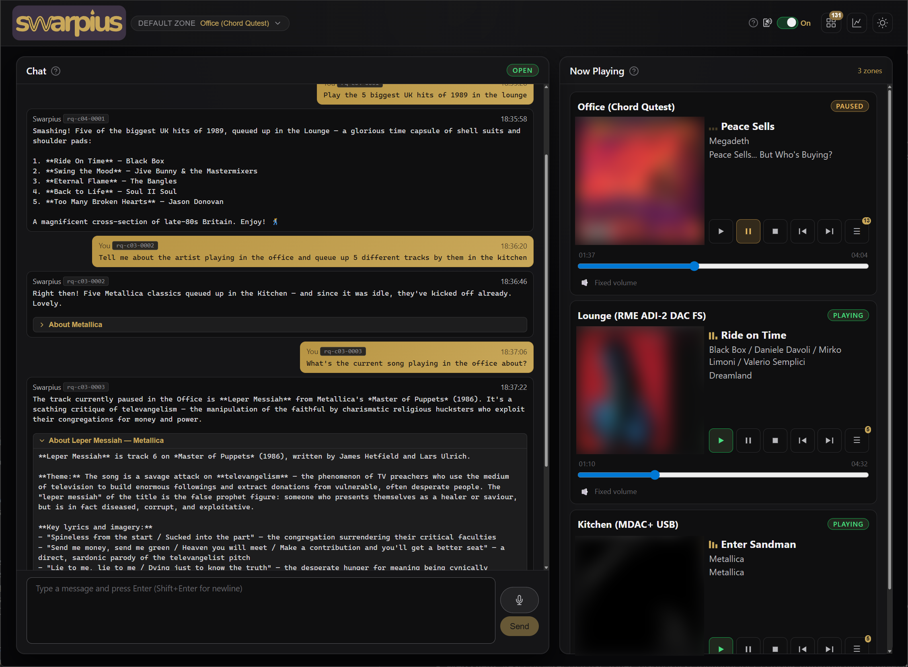
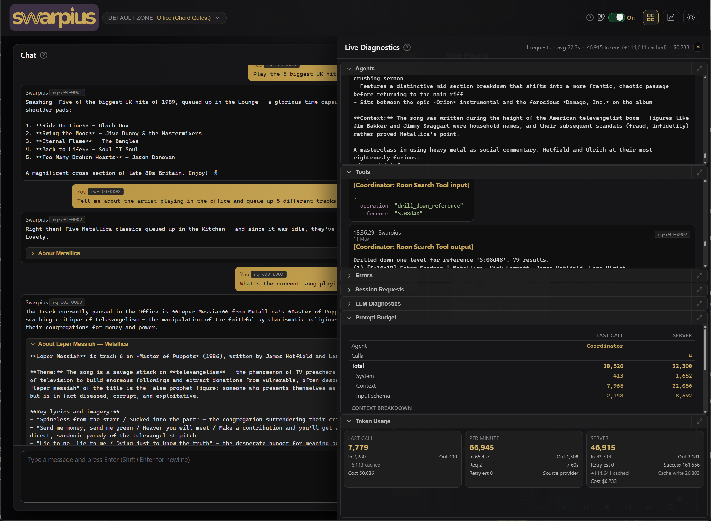
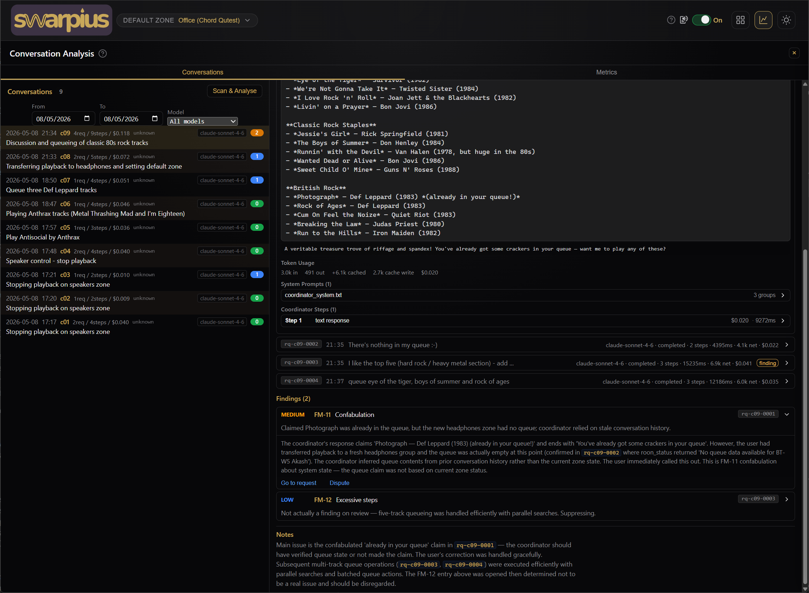
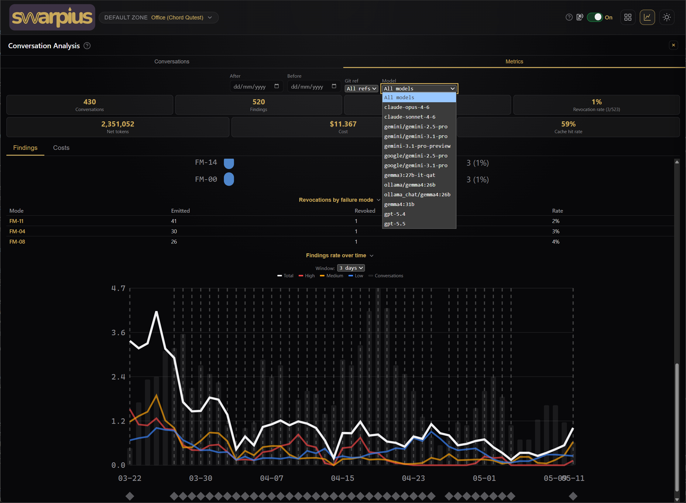
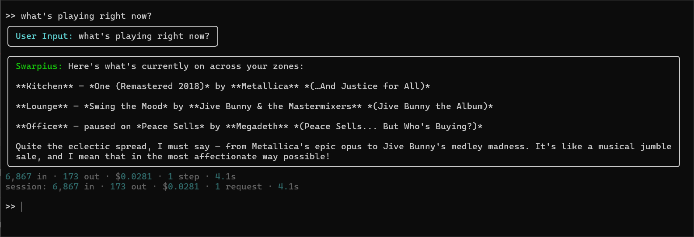

# Swarpius™ — an LLM-driven assistant for Roon

Swarpius navigates your [Roon](https://roon.app) library using multi-step tool calling, including searching, drilling down into results, and executing playback actions. It can perform various configuration actions such as grouping / ungrouping zones, setting volumes, and assigning aliases to zones and zone groups. It can also search the web (when provided with a suitable web-search tool) for additional information. This gives it the ability to handle complex requests like "play the 5 biggest UK hits of 1981", "tell me about the artist currently playing in the kitchen" or "queue up 25 random tracks from all my Led Zeppelin albums".

## Features

- **Natural language music control:** play, pause, queue, skip, seek, shuffle, transfer between zones
- **Library navigation:** search artists, albums, tracks, playlists; drill into results across multiple steps
- **Multi-zone support:** control any Roon zone by name or alias, with fuzzy matching and zone grouping
- **Web search:** look up facts the Roon library can't answer, such as artist bios, era references, or hits from different years, and then chain those into Roon searches where needed. There are currently three backend options: [Brave](https://brave.com/search/api/) (free tier, recommended for new users), [Tavily](https://tavily.com/), or self-hosted [SearXNG](https://github.com/searxng/searxng) (not redistributed with this project)
- **Voice output:** optional text-to-speech via **[F5-TTS](https://github.com/SWivid/F5-TTS)** by SWivid (not redistributed with this project). Note that operating your own server requires an NVIDIA GPU and CUDA 12.8
- **Live playback UI:** real-time zone status, artwork, and transport controls in the browser
- **Persistent history:** chat and the assistant's working memory survive a restart, so you carry on where you left off. Scroll back through earlier days or jump to a date, and ask what you played ("what did I listen to last Tuesday?")
- **Developer Mode with Live Diagnostics & Conversation Analysis:** real-time request tracing, LLM call diagnostics, token usage tracking, and automated post-hoc conversation and action reviews. Double-click the Swarpius logo to toggle Developer Mode on and off; once on, Ctrl+Shift+D toggles the diagnostics drawer and Ctrl+Shift+A toggles the analysis browser
- **Any LLM provider:** Anthropic, OpenAI, Gemini, Ollama, LM Studio, or anything LiteLLM supports. Bring your own key

## Screenshots

### Web client — default view



*Chat on the left, live zone status with artwork and controls on the right. One card per Roon zone / group, refreshed in real time. A sun/moon switch in the top-right header flips between dark and light themes.*

### Web client — developer diagnostics



*Double-click the Swarpius logo to toggle Developer Mode; once on, Ctrl+Shift+D toggles the diagnostics drawer. Shows active and completed LLM calls, prompt token breakdowns, step-by-step request timelines, and prompt-budget tracking.*

### Conversation analysis — conversations view



*Per-conversation review of completed exchanges. Each finding is classified against a 19-mode failure taxonomy with severity calibration; findings the analyser reconsidered are surfaced in a separate "Revoked findings" section with the model's reasoning preserved. Click the "finding" badge on a request row to jump to its finding(s); historical versions are kept when conversations are re-analysed.*

### Conversation analysis — metrics view



*Aggregated quality metrics across the selected date / git-ref / model range. Top-line cards (conversations, findings, avg steps per request, revocation rate, net tokens, cost, cache hit rate) sit above charts for findings by severity, findings by failure mode, revocations by failure mode, and findings rate over time. A separate Costs tab displays charts for token usage & cost over time, cache hit rate over time, and mean cost by request / complexity.*

### CLI mode



*Same agent and tools, no browser. The startup banner shows the resolved configuration (models, web-search backend, TTS, etc.); each request is framed with a per-step spinner and a one-line telemetry summary.*

## Components and Architecture

### Components

There are five components across four services managed via a `docker-compose.yml`. Each service's folder has its own README.md with further details:

- **Agent:** the core tool-calling Python backend; **required**.
- **Web client:** React browser UI (chat, zones, diagnostics, conversation analysis); *(not required for CLI mode, automatically included in Docker and Installer versions)*.
- **Web search** *(optional but strongly recommended, configured separately)***:** answers queries that need external information (e.g. "biggest UK hit in 1976", band histories, release dates). Three backend options — see [Web search](#web-search-strongly-recommended). Without it (and depending on the model being used) the agent may rely on its own knowledge, ask you for more information, or report that it cannot carry out the task. The `searxng` Docker service in this section enables only the SearXNG self-hosted backend (configuration file stored in `searxng/`); Brave and Tavily are configured purely via `agent/.env` or the settings page in the UI (*UI settings not configurable in Docker*).
- **TTS server** *(optional)***:** spoken responses via [F5-TTS](https://github.com/SWivid/F5-TTS). Chat is text-only without it. Contains a Dockerfile that pulls in the F5-TTS source code and builds it, a websocket proxy to enable streaming audio to web browsers, and a voices folder for optional voice cloning. (*Server hosting requires an NVIDIA GPU and CUDA 12.8*)
- **Passive analyser** *(optional, in-process)***:** post-hoc LLM analysis of conversation and action quality, surfaced in the analysis browser. If configured, it runs inside the agent process; see [`docs/analyser.md`](docs/analyser.md).

There are three ways to install and run Swarpius: via [installer](#installed-app-windows-macos-linux), using [Docker](#quickstart-docker-compose--recommended), or directly from [source](#quickstart-run-from-source--for-development). Find these sections further down this document.

### Architecture

```
                       Browser
                      /        \
           HTTP (port 5173)     WebSocket (port 8080)
                  |                     |
           +--------------+       +--------------+
           |  Web Client  |       |    Agent     |   Python backend -- LLM orchestration, Roon tools
           +--------------+       +--------------+
            React/Vite              /    |     \
                              Roon Core  |   Web Search
                                         |    (optional)
                                  +--------------+          +------------------+
                                  |  TTS Server  |          | Passive Analyser |
                                  +--------------+          +------------------+
                                  (optional, GPU)           (optional, in-process)
```

The browser loads the static React app from the web client over HTTP, then opens a WebSocket directly to the agent for chat, live playback state, and diagnostics. It can also be configured to connect with an F5-TTS server to stream generated speech audio. **Note:** On installer bundles, the UI connects on port 8080 rather than 5173.

## Important: Security before you run Swarpius

> [!IMPORTANT]
> **Read [SECURITY.md](SECURITY.md) before running Swarpius on anything beyond a single trusted machine.** The agent's WebSocket has **no built-in authentication** — the `127.0.0.1` defaults are safe on one host, but if you expose it to your LAN or split the agent and browser across machines (common for Docker / source setups), you **must** add an auth layer (overlay VPN, authenticating reverse proxy, or SSH tunnel). Otherwise anyone who can reach it can drive the agent and read your API keys. See [SECURITY.md → Network exposure](SECURITY.md#network-exposure).

## Installed app (Windows, macOS, Linux)

If you want to use Swarpius without having to install Python, Node or Docker, you can download the latest packaged build from this page and install / run it with minimal effort. Builds are available for Windows, Linux and macOS (Apple silicon only - M1 and above). Your browser opens to the Settings page on first launch, and the in-app Getting Started guide walks you through setup. **Note: Closing the browser shuts down the app - run the program again to get it back.**

See [`docs/installed-app.md`](docs/installed-app.md) for install, update, uninstall, and download-verification details.

## Quickstart (Docker Compose) — recommended

### Prerequisites

- Docker and Docker Compose
- A running [Roon Core](https://roon.app) on the same network
- An API key for at least one LLM provider (Anthropic, OpenAI, etc.), or a local model via Ollama

### Step 1 — Configure the agent

Copy the template to a working file:

```bash
cp agent/.env.template agent/.env
```

There are two mandatory values for running the agent. Open `agent/.env` and set `LLM_MODEL` and `LLM_API_KEY_<PROVIDER>`, where `<PROVIDER>` may be `ANTHROPIC`, `GEMINI`, `OPENAI`, `OLLAMA_CHAT` etc. Example:

```ini
LLM_MODEL="anthropic/claude-sonnet-4-6"
LLM_API_KEY_ANTHROPIC="sk-ant-..."
```

All other settings have working defaults, including auto-discovery of your Roon Core, the first zone reported by Roon set as the default zone, and with web search disabled by default. See `agent/.env.template` for a full list of configuration options.

> [!NOTE]
> **Configuration file split:** `agent/.env` holds the agent's own settings (LLM keys, Roon, persona, analyser tuning). When running in Docker, web-search and external TTS configuration lives in a **separate top-level `.env`** at the repo root — see [`.env.template`](.env.template) and the [Web search](#web-search-strongly-recommended) section below. When running from source, the top-level `.env` is ignored and everything lives in `agent/.env`.

> [!NOTE]
> **Docker Desktop users (Windows / macOS):** Roon's auto-discovery uses multicast (SOOD) which Docker Desktop doesn't forward into containers, so Swarpius may not find your Core automatically. Set the Core's IP explicitly in `agent/.env`, e.g.:
> ```ini
> ROON_CORE_URL="http://192.168.1.100:9330"
> ```
> Find the IP of your Roon Server in the Roon app under **Settings → General**. Docker users on **Linux** should be able to use auto-discovery.

> [!IMPORTANT]
> Hosted LLM providers (Anthropic, OpenAI, Google) bill per token. **You are responsible for any charges incurred** — set per-provider spend limits at your provider's billing console as a safety net. Local Ollama models are free. Swarpius is provided "as is" with no warranty; see [License & Disclaimer](#license--disclaimer) below.

### Step 2 — Start the stack

> [!NOTE]
> **Docker bind-mount permissions:** the agent container runs as a non-root user with UID `1000` by default — the first user on Linux and on Windows/WSL2. The first user on macOS gets `501`; subsequent users on any OS get incremented IDs (1001, 502, ...). To make the container UID match your host user's, run this once from the repo root **before** `docker compose up`:
> ```bash
> echo "HOST_UID=$(id -u)" > .env
> ```
> Skip this and you may hit permission errors writing Roon auth tokens, logs, or message history into the bind-mounted `./agent/data` directory. See `.env.template` in the root folder for other Compose-level overrides.

```bash
docker compose up -d
```

This brings up two services: the agent and the web client. The agent will start and immediately wait for Roon to approve the extension (Step 3).

### Step 3 — Approve the Swarpius extension in Roon

Open the Roon app and go to **Settings → Extensions**. You'll see *Swarpius* listed as pending — click **Enable**.

The agent waits up to 2 minutes for your approval before timing out. If it does time out, just `docker compose restart swarpius-agent` and try again.

### Step 4 — Verify

Open `http://localhost:5173` in your browser. You should see the Swarpius chat interface, ready to type into. Try a simple request like *"what's playing?"* to confirm the connection.

By default this works only from the machine running Swarpius. To reach it from a phone, tablet, or another computer on your network, see [Connecting from another device](#connecting-from-another-device).

If the page shows a *"continuing to attempt connection…"* overlay, the most likely cause is Step 3 — go back to Roon and approve the extension. The overlay lists other things to check.

**Strongly recommended next step:** configure web search to enable Swarpius to leverage external information, for Roon library searches as well as general queries. See [Web search](#web-search-strongly-recommended) below.

### Optional services

#### Web search
This is configured separately. See [Web search](#web-search-strongly-recommended) for the three backend options (Brave, Tavily, or self-hosted SearXNG). Strongly recommended for a richer experience.

#### Text-to-Speech
We include an [F5-TTS](https://github.com/SWivid/F5-TTS) service definition and Dockerfile for those who want to build and host locally. The following pulls in the repo and builds the image if it doesn't yet exist (requires an NVIDIA GPU and CUDA 12.8 installed). Note that it can take some time to build:

```bash
cp tts-server/.env.template tts-server/.env
docker compose --profile tts up -d
```

#### Passive conversation analyser
This is a scheduled analyser that regularly scans for new conversations and evaluates your chosen model's performance. You can opt-in by doing the following:

```bash
# Enable in agent/.env, then restart the agent container
echo 'ENABLE_PASSIVE_ANALYSER="true"' >> agent/.env
docker compose restart swarpius-agent
```
The analyser runs inside the agent process, rather than in a separate container.
The "Scan & Analyse" / "Re-Analyse" buttons in the web UI work even
without the passive analyser enabled. See [`docs/analyser.md`](docs/analyser.md)
for full configuration.

To build and run everything at once:

```bash
docker compose --profile all up -d
```

## Quickstart (run from source) — for development

This is the alternative option if you don't have Docker and don't want to install it. You can also enable CLI mode, which runs the agent directly in your terminal without the need for a browser.

### Prerequisites

- Python 3.13
- `portaudio19-dev` (Linux) or `portaudio` (macOS). These are needed by PyAudio for CLI-mode TTS. In Ubuntu/Debian, use `sudo apt install portaudio19-dev`; in macOS via Homebrew, use `brew install portaudio`. May be skipped if you don't want voice output (see Step 1).
- A running [Roon Core](https://roon.app) on the same network
- An API key for at least one LLM provider, or a local model via Ollama

### Step 1 — Install agent dependencies

```bash
cd agent
python3 -m venv .venv
source .venv/bin/activate            # Linux / macOS / WSL
# or: .venv\Scripts\Activate.ps1     # Windows PowerShell
python3 -m pip install -r requirements.txt
```

`requirements.txt` includes the audio dependencies for playback of F5-TTS generated audio in CLI mode. If you don't want voice output, use `requirements-server.txt` instead, which is the no-audio, no-portaudio variant.

### Step 2 — Configure the agent

```bash
cp .env.template .env
```

Open `.env` and set the two required values (same as for Docker). These are `LLM_MODEL` and `LLM_API_KEY_<PROVIDER>` where `<PROVIDER>` can be `ANTHROPIC`, `GEMINI`, `OPENAI`, `OLLAMA_CHAT` etc. Example:

```ini
LLM_MODEL="anthropic/claude-sonnet-4-6"
LLM_API_KEY_ANTHROPIC="sk-ant-..."
```

### Step 3 — Start the agent

```bash
python3 swarpius.py
```

The agent starts and immediately waits for Roon to approve the extension (Step 4).

### Step 4 — Approve the Swarpius extension in Roon

Same as the Docker flow — Roon app → **Settings → Extensions** → click **Enable** on the pending *Swarpius* entry. The agent waits up to 2 minutes for approval before timing out.

### Step 5 — Talk to it

Once authorised, you can talk to the agent in the terminal, e.g.:

```
> play OK Computer in the kitchen
> what's playing?
> queue up 31 random tracks from the following artists: AC/DC, Chumbawumba, Neil Sedaka
> /exit
```

Slash commands: `/exit` to quit, `/usage` for detailed token usage. Readline command history persists between sessions.

### Using the Web UI

If you prefer to use Swarpius via the browser (required for developer mode), run the agent in WebSocket mode (`python3 swarpius.py --ws`) and start the web client dev server separately. See [`web-client/README.md`](web-client/README.md) for the npm setup.

## Connecting from another device

By default the agent listens only on the machine it runs on (`127.0.0.1`), so it's reachable only from a browser on that same machine. That's the safe default — the browser-to-agent connection has **no authentication**. To reach Swarpius from a phone, tablet, or another computer on your network, bind it to all interfaces. Which variable to set depends on how you run it:

| Run mode | Set | In |
|---|---|---|
| **Docker** | `SWARPIUS_BIND_IP=0.0.0.0` | top-level `.env` (or your shell before `docker compose up`) |
| **From source** | `SWARPIUS_WS_HOST="0.0.0.0"` | `agent/.env` |
| **Installer** | `SWARPIUS_WS_HOST="0.0.0.0"` | the `.env` in your data folder |

Apply it with `docker compose up -d` (Docker — a `restart` from Settings won't re-read the port mapping) or by restarting the agent (source / installed app).

The names differ because they act at different layers: under Docker the agent always listens inside the container, and host exposure is gated at Docker's port-publish layer (`SWARPIUS_BIND_IP`, matching `CLIENT_BIND_IP` / `TTS_BIND_IP` / `SEARXNG_BIND_IP`); run from source, the agent binds its own address directly (`SWARPIUS_WS_HOST`).

> [!IMPORTANT]
> Only expose Swarpius on a network you trust. The agent has **no authentication** — anyone who can reach it can control playback and read your configured API keys. For anything beyond a single trusted LAN, put an authentication layer in front. See [SECURITY.md → Network exposure](SECURITY.md#network-exposure).

## Web search (strongly recommended)

Web search provides Swarpius with the ability to look up information not available via Roon search, and which can then be used to support Roon library searches if needed. This enables queries such as *"who was the lead singer of Cream?"*, *"play the most popular album of 1984"*, *"what were the biggest UK club hits in the 1990s?"*.

> [!IMPORTANT]
> A fresh Swarpius install has web search set **off by default**, with no `web_search` tool registered. The agent's startup log will show `Web search backend: disabled` until you set one of the options below.

There are currently three supported search services, ordered by recommendation. **Pick one** and configure it via the env file that matches your install. Quote values in `agent/.env`, but not in the Docker `.env`:

- **Run from source** → `agent/.env` — quoted, e.g. `WEB_SEARCH_PROVIDER="brave"`
- **Docker** → top-level `.env` (at the repo root, alongside `docker-compose.yml`) — unquoted, e.g. `WEB_SEARCH_PROVIDER=brave`

The snippets below are shown in the `agent/.env` (quoted) form unless labelled for Docker; drop the quotes when configuring the Docker `.env`. (Why the split for Docker: compose's `environment:` block overrides any web-search settings in `agent/.env`, so changes there have no effect in the container. See [`.env.template`](.env.template) at the repo root.)

### Brave Search — recommended for new users

The free tier covers ~2,000 queries per month. There is a single-step signup at [brave.com/search/api/](https://brave.com/search/api/) that takes under a minute, with no credit card required to generate an API key.

In `agent/.env` (source) or top-level `.env` (Docker):

```ini
WEB_SEARCH_PROVIDER="brave"
BRAVE_API_KEY="your-key-here"
```

Then restart the agent (`docker compose restart swarpius-agent`). The startup log will confirm `Web search backend: brave`.

### Tavily

This is a managed alternative with a smaller free tier (~1,000 queries/month). You can sign up at [tavily.com](https://tavily.com/) and configure it like so in `agent/.env` (source) or top-level `.env` (Docker) before restarting `swarpius-agent`:

```ini
WEB_SEARCH_PROVIDER="tavily"
TAVILY_API_KEY="your-key-here"
```

### SearXNG — self-hosted

This is ideal for users who prefer not to depend on a third-party API, and may be optionally included via Docker Compose using `--profile search`.

> [!NOTE]
> [SearXNG](https://github.com/searxng/searxng) is licensed under [AGPL-3.0](https://www.gnu.org/licenses/agpl-3.0.html). When you opt in via `--profile search`, Docker pulls the image directly from Docker Hub — **Swarpius itself does not redistribute SearXNG.** Because Swarpius calls it as an HTTP service rather than embedding or modifying it, AGPL §13 obligations don't propagate to Swarpius or to code that depends on it; they apply only to SearXNG itself, under the terms you accept by pulling the image.
>
> At runtime, the wrapper at [`searxng/entrypoint.sh`](searxng/entrypoint.sh) generates `settings.yml` from the template inside the SearXNG image and adds `formats: [html, json]` so the agent's `web_search` tool can read JSON results. This config-only change happens on your host, is not redistributed by us, and is plainly visible in the wrapper. If you expose your SearXNG instance to other users over a network (rather than running it just for yourself on `127.0.0.1`), AGPL §13 may apply to *you* as the operator — corresponding source is the original SearXNG project ([github.com/searxng/searxng](https://github.com/searxng/searxng), as published in the image tag you pulled) plus the wrapper script in this repo.

**Docker** — set the following in the top-level `.env`:

```ini
WEB_SEARCH_PROVIDER=searxng
```

Then start the bundled service:

```bash
docker compose --profile search up -d
```

`SEARXNG_URL` defaults to the bundled service hostname (`http://searxng:8080`) — no need to set it. For an **external** SearXNG instance instead, don't start the profile and set `SEARXNG_URL` in the top-level `.env` to where it's reachable.

**Run from source** (agent running outside Docker, SearXNG via Docker) — set both in `agent/.env`:

```ini
WEB_SEARCH_PROVIDER="searxng"
SEARXNG_URL="http://localhost:8888"
```

**Optional: set `SEARXNG_SECRET`** — on first boot the SearXNG container generates a random `secret_key` into its `settings.yml` (stored in the `searxng-config` Docker volume — per host, persisted across restarts), so the default deployment is already safe to expose on your LAN. If you'd rather manage the key explicitly — e.g. to rotate it, or to keep an identical key across multiple hosts behind a load balancer — set `SEARXNG_SECRET`:

```bash
export SEARXNG_SECRET="$(openssl rand -hex 32)"
docker compose --profile search up -d
```

### Disabling web search

Leave `WEB_SEARCH_PROVIDER` unset (or set it to `"none"`) — the startup log shows `Web search backend: disabled`. The `web_search` tool is then not registered, and Swarpius attempts to carry out requests without it.

## Stop marker — required for the Stop button

The Roon API doesn't expose a real `stop` primitive; its native `stop` control aliases to pause. Swarpius simulates a real stop (queue cleared, playback ended) by playing a 500ms silent audio file you install in your Roon library. Until this file is added to your library, the STOP button on each zone card is shown in a muted warning style with a setup-hint tooltip, and the LLM-driven `stop` action returns a setup-required error. If you add the file to your library while the server is running, clicking the STOP button in any zone card will attempt to initialise the simulated stop feature.

The file is provided at `assets/Swarpius Stop Simulation/Swarpius_Stop_Playback.wav` in this repo. To install it:

1. Copy the entire `Swarpius Stop Simulation/` folder found inside the `assets/` folder to somewhere Roon can scan it. Two equivalent options:
   - **Easiest:** drop it inside an existing folder Roon already watches (visible under **Settings → Storage** in the Roon app).
   - **Or:** copy it somewhere convenient and add that location as a watched folder via **Settings → Storage → Add Folder**.
2. Wait for Roon to scan it. The track appears in your library titled **Swarpius_Stop_Playback**.
3. (Re)-start the Swarpius server, **or** if the server is already running, click the STOP button in any zone card to initialise the function.

Once installed, both the STOP button (instant click) and natural-language stop requests ("stop", "stop the music") work — Swarpius plays the 500ms silent track (which clears the queue in the zone concerned), disables the auto-radio, and playback ends cleanly.

If you want to use a different filename, set `ROON_STOP_MARKER_TITLE` in `agent/.env` to whatever your file's track title is in Roon. If you want to disable the stop simulation feature entirely, set `DISABLE_SIMULATED_STOP="true"` in `agent/.env`; this removes the STOP button entirely from the UI, and all `stop` commands revert to `pause`.

## Default ports

| Service | Port | URL |
|---|---|---|
| Web client | 5173 | `http://localhost:5173` |
| Agent WebSocket | 8080 | `ws://localhost:8080/ws` (chat) and `ws://localhost:8080/tts` (TTS proxy) |
| SearXNG (self-hosted web search only) | 8888 | `http://localhost:8888` |
| F5-TTS TCP API | 9998 | `localhost:9998` (agent connects directly; browser uses the agent's `/tts` path) |

All bind addresses and ports are configurable via environment variables in `docker-compose.yml`.

## Security and privacy

**Swarpius is designed to run self-hosted on a trusted LAN by a single operator**. The agent's WebSocket endpoint has **no authentication, no Origin check, and no per-client rate limiting** — anyone who can reach it can drive the agent (chat, Roon transport control, log access) and read or overwrite the configured API keys. A few things to know up front:

- **Default bind is `127.0.0.1`.** A fresh `docker compose up` is reachable only from the host that runs it. To use Swarpius from a phone or laptop on your LAN, set the relevant `*_BIND_IP=0.0.0.0` env vars before bringing the stack up:

  ```bash
  SWARPIUS_BIND_IP=0.0.0.0 CLIENT_BIND_IP=0.0.0.0 docker compose up -d
  ```

  Add `TTS_BIND_IP=0.0.0.0` if running the TTS profile, `SEARXNG_BIND_IP=0.0.0.0` if exposing SearXNG. These may also be set in an `.env` file in the root folder instead of on the command line, and Docker Compose will pick them up. For a **source or installed-app** run, set `SWARPIUS_WS_HOST="0.0.0.0"` instead (in `agent/.env` for source; in the data-folder `.env` for the installed app).

- **Do not expose the agent or web client to the public internet.** Browsers do not enforce same-origin on WebSockets, so any web page a LAN user visits could connect to an internet-reachable agent and drive it. For non-LAN access, front the agent with an authenticated reverse proxy (Tailscale, ZeroTier, Cloudflare Tunnel + Access, nginx + basic auth, WireGuard mesh).

- **Local logs contain user-identifiable content**: chat messages, library titles, search queries, model responses. Default `logs/` retention is 7 days (`LOG_RETENTION_DAYS`). Chat history, the assistant's working memory, and a listening-history record persist across restarts in `messages.db`, pruned on their own windows (`CHAT_HISTORY_RETENTION_DAYS` 90, `DIAGNOSTICS_RETENTION_DAYS` 30, `LISTENING_HISTORY_RETENTION_DAYS` 365; `0` keeps forever); clear them from Settings → Privacy & Data. All log paths are gitignored. For public bug reports, **scrub `agent/data/` and any `.env*` files** first; if a meaningful diagnosis needs unscrubbed logs, email **[dev@paraseva.ai](mailto:dev@paraseva.ai)** privately instead. See [SECURITY.md](SECURITY.md#local-logs-and-privacy) for the full policy.

- **LLM API keys live in `agent/.env`.** Set per-provider spend limits at the provider's billing console as a safety net. Because a connected client can read or overwrite these over the WebSocket, prefer a **dedicated** key (separate from your main one) and add an auth layer for anything beyond a single trusted machine — see [SECURITY.md](SECURITY.md#network-exposure) for VPN / reverse-proxy / SSH-tunnel options. Keep `.env` out of source control (it's gitignored by default).

For the full threat model, accepted residuals, outbound host allowlist, key rotation guidance, and vulnerability reporting contact, see [SECURITY.md](SECURITY.md).

## Documentation

In-depth references for users and contributors live in [`docs/`](docs/):

- [`installed-app.md`](docs/installed-app.md): installing, updating, and managing the packaged Windows/macOS/Linux app, and where its data lives.
- [`architecture.md`](docs/architecture.md): agent backend internals: request flow, tool loop, system prompt assembly, observability.
- [`tool-system.md`](docs/tool-system.md): how tools and `SKILL.md` prompt fragments work, and how to add new ones.
- [`how-roon-browse-works.md`](docs/how-roon-browse-works.md): empirical reference for Roon's Browse API and the stable-reference layer Swarpius builds on top.
- [`model-profiles.md`](docs/model-profiles.md): per-model LLM tuning (temperature, step limits, provider flags) via `agent/model_profiles.yaml`.
- [`tts-adapters.md`](docs/tts-adapters.md): TTS wire protocol and how to swap F5-TTS for a different backend.
- [`web-client.md`](docs/web-client.md): React/Vite frontend architecture, WebSocket message routing, panel components.
- [`logging.md`](docs/logging.md): per-request log layout, conversation grouping, retention policy.
- [`category-reconciliation.md`](docs/category-reconciliation.md): how Swarpius reconciles user-supplied categories against Roon's browse hierarchy.
- [`loop-detection.md`](docs/loop-detection.md): tool-loop guardrails — repeat detection, soft nudges, hard step limit.
- [`known-limitations.md`](docs/known-limitations.md): an accounting of what Swarpius can't do today.

## Supported LLM providers

Swarpius uses [LiteLLM](https://docs.litellm.ai) for multi-provider support. Any provider LiteLLM supports will work, but **the model you use for Swarpius will naturally underpin the quality of the experience**. LLMs can make mistakes, and you will likely see these from time to time even on the best models. Expect performance to improve as you move up in model quality and as newer models emerge, with diminishing returns at the top end.

The following models have been tested:

| Provider | Example model | Notes |
|---|---|---|
| Anthropic | `anthropic/claude-sonnet-4-6` | **Recommended.** Sonnet tends to handle the full request range reliably with better efficiency, thoughtfulness, and persona richness. Haiku 4.5 is a cheaper step down for simpler traffic, but may stumble on complex requests. Prompt caching supported. |
| Google | `gemini/gemini-2.5-pro` | Gemini 2.5 Pro and 3.1 Pro Preview are viable options that generally handle the full request range. |
| OpenAI | `openai/gpt-5.4` | GPT 5.4 and 5.5 show similar overall capability to the Gemini models above. |
| Ollama | `ollama_chat/gemma4:26b` | Local, no API key needed. Gemma 4 may work for very simple single-intent requests, but will struggle with multi-source flows. Gemma 3 is unviable. Other, larger models may prove more effective, but haven't been tested. |
| Other LiteLLM providers | — | LM Studio, vLLM, Groq etc. are supported by the architecture but haven't been tested. |

See [`docs/model-profiles.md`](docs/model-profiles.md) for per-model tuning and detailed quality notes. Per-model knobs (temperature, step limits, provider-specific flags) live in `agent/model_profiles.yaml`.

## System requirements

The Swarpius services themselves — agent, web client, SearXNG — are lightweight and run comfortably on modest hardware. The hardware question really comes down to where you run the LLM and (optionally) the TTS model:

- **Cloud LLM + cloud TTS / no TTS:** any reasonable home machine or NAS. CPU and RAM aren't the bottleneck.
- **Local LLM (Ollama, LM Studio, vLLM):** an adequate GPU for the model you choose. See [Supported LLM providers](#supported-llm-providers) above for which local models we've tested.
- **Local F5-TTS server:** an NVIDIA GPU with CUDA 12.8. There is no CPU fallback for TTS.

Swarpius has been tested against local audio files in Roon plus Qobuz and Tidal as connected streaming providers; other Roon-compatible services should work as long as Roon exposes them consistently through its browse API.

## Why not just use a Roon MCP server with Claude Desktop?

Both are legitimate paths. [Model Context Protocol](https://modelcontextprotocol.io) servers for Roon already exist (e.g. [RWAV Bridge](https://rwav-bridge.co.uk/mcp/), `roon-mcp`); paired with a chat client like Claude Desktop, they give you composability — drop in another MCP server for any new capability. Swarpius gives you a pre-tuned music-shaped agent in one package: opinionated orchestration (loop detection, interrupt arbitration, parallel-safe Roon batching), domain-specific observability, and provider-neutral model choice via LiteLLM. Pick whichever shape fits your setup. The two aren't mutually exclusive — Swarpius's deeper tools may also be exposed as an MCP server in future, so users who prefer that path can get the same Roon coverage without losing composability.

## Credits

The two optional services we include Docker compose configurations for are:

- **[F5-TTS](https://github.com/SWivid/F5-TTS)** by SWivid: the voice-cloning text-to-speech model that powers the optional `tts-server` service. The TTS server image pulls in the project from GitHub at build time.
- **[SearXNG](https://github.com/searxng/searxng)**: the metasearch engine that powers the optional self-hosted web-search backend. See [Web search](#web-search-strongly-recommended) for the full picture of search backends, including the managed alternatives (Brave, Tavily) we recommend for users who don't wish to self-host.

The agent and web client also make use of a host of open-source libraries. See [`THIRD_PARTY_NOTICES.md`](THIRD_PARTY_NOTICES.md) for per-component licenses and links to sources.

## Reporting issues and contributing

Bug reports, feature requests, and pull requests are welcome — see [CONTRIBUTING.md](CONTRIBUTING.md) for the bug-report and feature-request templates, dev environment setup, and the code-style conventions. For security vulnerabilities, please follow the private disclosure process in [SECURITY.md](SECURITY.md) rather than opening a public issue.

## License & Disclaimer

Swarpius is released under the [Apache License 2.0](LICENSE).

**No warranty.** Swarpius is provided "AS IS", without warranty of any kind, express or implied. The authors and contributors are not liable for any damages, data loss, service disruption, or costs — including but not limited to LLM API charges, cloud infrastructure costs, or third-party service fees — incurred through use of this software. You use it at your own risk. See [LICENSE](LICENSE) sections 7 and 8 for the full legal text.

## Trademarks

Swarpius is an independent project and is not affiliated with, or endorsed by, Roon Labs LLC. Roon is a trademark of Roon Labs LLC. All other trademarks are the property of their respective owners.
